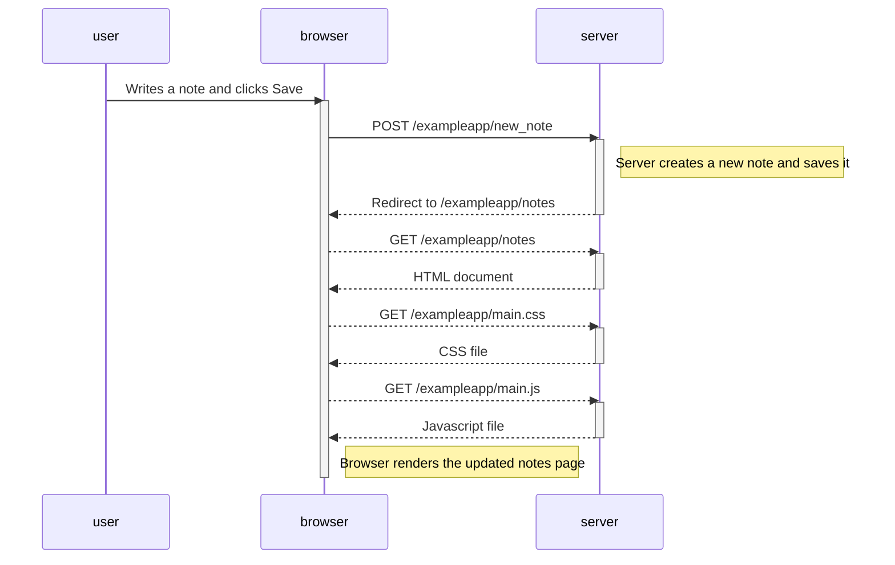

```mermaid
sequenceDiagram
    participant user
    participant browser
    participant server

    user->>browser: Writes a note and clicks Save

    activate browser
    browser->>server: POST /exampleapp/new_note
    activate server
    
    Note right of server: Server creates a new note and saves it

    server-->>browser: Redirect to /exampleapp/notes
    deactivate server

    browser-->>server: GET /exampleapp/notes
    activate server

    server-->>browser: HTML document
    deactivate server

    browser-->>server: GET /exampleapp/main.css
    activate server
    server-->>browser: CSS file
    deactivate server

    browser-->>server: GET /exampleapp/main.js
    activate server
    server-->>browser: Javascript file
    deactivate server

    Note right of browser: Browser renders the updated notes page
    deactivate browser
```