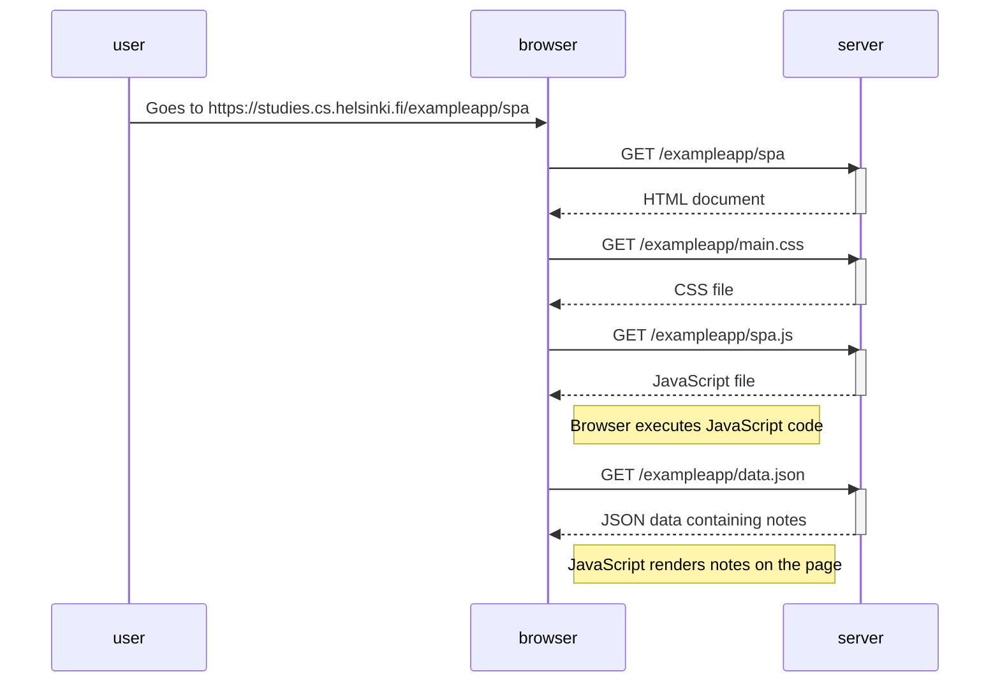

```mermaid
sequenceDiagram
    participant user
    participant browser
    participant server

    user->>browser: Goes to https://studies.cs.helsinki.fi/exampleapp/spa

    browser->>server: GET /exampleapp/spa
    activate server
    server-->>browser: HTML document
    deactivate server

    browser->>server: GET /exampleapp/main.css
    activate server
    server-->>browser: CSS file
    deactivate server

    browser->>server: GET /exampleapp/spa.js
    activate server
    server-->>browser: JavaScript file
    deactivate server

    Note right of browser: Browser executes JavaScript code

    browser->>server: GET /exampleapp/data.json
    activate server
    server-->>browser: JSON data containing notes
    deactivate server

    Note right of browser: JavaScript renders notes on the page
```