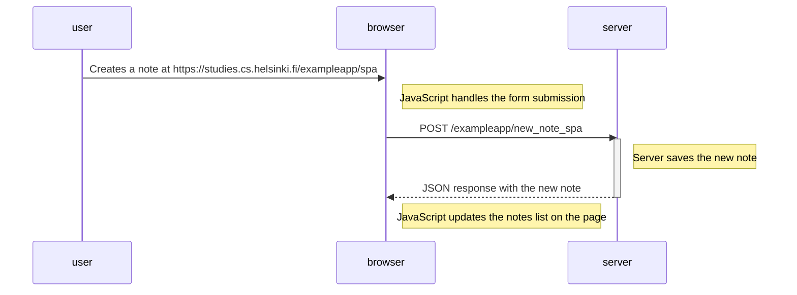

```mermaid
sequenceDiagram
    participant user
    participant browser
    participant server

    user->>browser: Creates a note at https://studies.cs.helsinki.fi/exampleapp/spa 

    Note right of browser: JavaScript handles the form submission

    browser->>server: POST /exampleapp/new_note_spa
    activate server

    Note right of server: Server saves the new note

    server-->>browser: JSON response with the new note
    deactivate server

    Note right of browser: JavaScript updates the notes list on the page
```